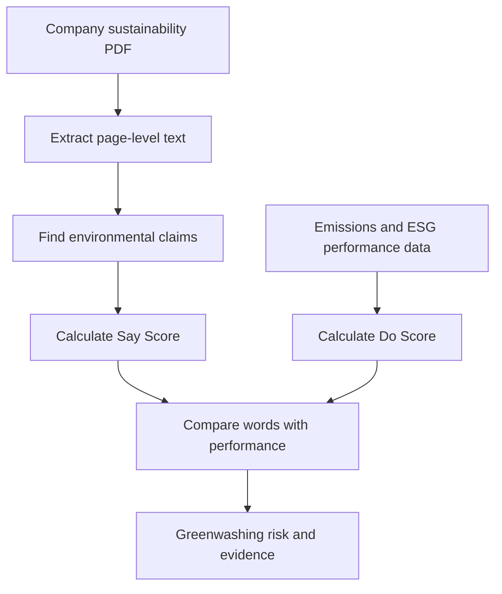

# 🌱 ESG Greenwashing Detector


**A public truth-checker for corporate sustainability claims.**

Companies publish polished sustainability reports filled with promises such as *“net zero by 2030”* and *“committed to a greener future.”* This project asks a simple question:

> Do the company’s words match its measurable environmental performance?

The ESG Greenwashing Detector extracts environmental claims from company reports, evaluates how specific and verifiable they are, compares them with real performance data, and highlights possible greenwashing risks.

---

## Why this project exists

A sustainability report can be hundreds of pages long. Investors, journalists, consumers, and ESG analysts should not need to manually read every page to determine whether a company’s environmental claims are meaningful.

This project aims to turn those reports into a simple, explainable result:

- What did the company claim?
- Was the claim specific or vague?
- Did it include a number, deadline, or baseline?
- Does the company’s actual environmental performance support the claim?
- Which claims deserve closer investigation?

This tool does not declare that a company is lying. It identifies gaps and warning signs that humans can investigate further.

---

## The end goal

The finished product will allow a user to:

1. Search for a company or upload its sustainability report.
2. Automatically extract environmental claims from the report.
3. Separate measurable claims from vague marketing language.
4. Compare those claims with emissions and ESG performance data.
5. See a simple greenwashing-risk score.
6. Inspect the exact report pages and excerpts behind the score.
7. Understand the result without needing ESG or data-science expertise.

A company can only be analysed when a report and suitable comparison data are available. Scanned PDFs will eventually require OCR support.

---

## How it works



### The three main scores

| Score | Meaning |
|---|---|
| **Say Score** | How strong, specific, and measurable the company’s environmental claims are |
| **Do Score** | How strong the company’s measurable environmental performance is |
| **Gap Score** | The difference between what the company says and what its performance supports |

A company with ambitious, specific claims but weak measurable performance may receive a high greenwashing-risk signal.

The score is intended to guide investigation—not act as a final legal or factual judgment.

<details>
<summary><strong>What makes a claim specific?</strong></summary>

A claim becomes more verifiable when it contains details such as:

- A measurable target
- A target year
- A starting baseline
- A named emissions scope
- A reported result
- A source or supporting document

For example:

**Vague claim**

> We are committed to creating a greener future.

**More specific claim**

> We aim to reduce Scope 1 and Scope 2 emissions by 40% from a 2020 baseline by 2030.

The second claim can be measured and checked over time.

</details>

---

## Current project status

This project is being developed in stages. The current version already contains the foundation of the ETL and scoring system.

### Available now

- Source-aware company and claim data
- Separate company claims from external scrutiny
- CSV-to-SQLite loading pipeline
- Rule-based ESG scoring
- Scope 1 emissions-performance scoring
- Streamlit company leaderboard
- Company search and score explanations
- Page-by-page sustainability PDF extraction
- SHA-256 document fingerprints for traceability
- JSONL extraction output with page metadata
- Protection against committing large raw/generated files

### Being built next

- Climate and sustainability passage filtering
- Automated claim detection
- Specific-versus-vague claim classification
- Numbers, percentages, baseline, and target-year extraction
- PDF upload through the Streamlit interface
- Evidence excerpts linked to report pages
- Improved confidence scoring
- External emissions and ESG data connectors
- FastAPI company and claim endpoints
- Scheduled pipeline refreshes
- Tests, CI checks, deployment, and public demo

---

## ETL pipeline

The project is designed as a real ETL pipeline:

| Stage | Responsibility |
|---|---|
| **Extract** | Read sustainability PDFs and external ESG/emissions sources |
| **Transform** | Clean text, identify relevant passages, extract claims, and calculate scores |
| **Load** | Store companies, reports, claims, evidence, emissions, and scores in a database |
| **Serve** | Expose results through a dashboard and API |

The extractor currently converts each PDF page into an individual JSONL record containing:

```json
{
  "document_id": "sha256-document-fingerprint",
  "source_file": "company_sustainability_report.pdf",
  "page_number": 1,
  "total_pages": 90,
  "text": "Extracted report text...",
  "character_count": 1240,
  "has_text": true
}
```

This page-level structure allows every detected claim to eventually be traced back to its original evidence.

---

## Project structure

```text
esg-greenwashing-detector/
├── app/
│   └── streamlit_app.py
│
├── data/
│   ├── raw/
│   │   ├── claims.csv
│   │   ├── companies.csv
│   │   ├── emissions.csv
│   │   └── reports/
│   ├── extracted/
│   └── processed/
│
├── pipeline/
│   ├── extract/
│   │   └── pdf_extractor.py
│   ├── load_claims.py
│   ├── load_to_db.py
│   ├── run_queries.py
│   └── scoring.py
│
├── sql/
│   └── create_tables.sql
│
├── tests/
├── requirements.txt
└── README.md
```

Raw PDFs and generated JSONL files are intentionally excluded from Git because they may be large and can be regenerated.

---

## Run the project locally

### 1. Clone the repository

```bash
git clone https://github.com/walterHwhite1/esg-greenwashing-detector.git
cd esg-greenwashing-detector
```

### 2. Create a virtual environment

```bash
python -m venv .venv
```

Activate it on Windows PowerShell:

```powershell
.venv\Scripts\Activate.ps1
```

Activate it on macOS or Linux:

```bash
source .venv/bin/activate
```

### 3. Install dependencies

```bash
python -m pip install -r requirements.txt
```

### 4. Add a sustainability report

Place a text-based PDF inside:

```text
data/raw/reports/
```

### 5. Extract the report

```bash
python -m pipeline.extract.pdf_extractor "data/raw/reports/company_report.pdf"
```

The page-level output will be created inside:

```text
data/extracted/
```

### 6. Launch the dashboard

After preparing the project database, run:

```bash
streamlit run app/streamlit_app.py
```

---

## Planned user experience

A future analysis page will present results in plain language:

```text
Company: Example Energy Ltd.

Say Score: 82/100
Do Score: 41/100
Gap Score: 41

Risk signal: High

Why?
The company makes several ambitious emissions-reduction claims,
but its reported emissions have not decreased enough to support them.

Evidence:
“Reduce Scope 1 emissions by 40% by 2030.”
Report page: 34
```

Users will be able to open the original excerpt and understand why the result was produced.

---

## Roadmap

- [x] Build the first structured ESG dataset
- [x] Add source type, URL, retrieval date, and confidence
- [x] Separate company claims from regulatory and news scrutiny
- [x] Build the initial SQLite scoring workflow
- [x] Build the Streamlit leaderboard
- [x] Extract sustainability PDFs page by page
- [x] Produce traceable JSONL records
- [ ] Filter climate-related passages
- [ ] Extract structured environmental claims
- [ ] Detect vague and measurable language
- [ ] Calculate claim-level confidence
- [ ] Connect claims to evidence pages
- [ ] Add PDF upload and processing
- [ ] Add external emissions/ESG connectors
- [ ] Build FastAPI endpoints
- [ ] Add automated tests and CI
- [ ] Deploy the public application

---

## Important limitations

- A high risk score is not proof of intentional deception.
- A specific claim can still be factually incorrect.
- A vague statement is not automatically dishonest.
- ESG ratings from different providers may disagree.
- PDF extraction can struggle with scans and complex layouts.
- Missing performance data can reduce confidence in a result.
- Human review remains important for serious investment, regulatory, or journalistic decisions.

---

## Who could use it?

- Retail investors researching sustainable companies
- ESG and financial analysts
- Journalists investigating environmental claims
- Consumers comparing company promises
- Students and researchers studying sustainability reporting
- Compliance and audit teams prioritising reports for review

---

## Contributing

This project is currently under active development. Suggestions, bug reports, test reports, data-source recommendations, and scoring ideas are welcome through GitHub Issues.

If you want to contribute:

1. Fork the repository.
2. Create a feature branch.
3. Make and test your changes.
4. Open a pull request explaining what changed and why.

---

## Disclaimer

This project is an educational and analytical tool. It does not provide investment, legal, regulatory, or financial advice. Its scores are indicators designed to support further research and should not be treated as definitive judgments about a company.
What it does: Companies publish glossy sustainability reports full of promises ("we're committed to net-zero!"). This project checks if those words actually match reality — compares what a company says against its real ESG score (based on actual emissions/data, not marketing copy). Flags companies that talk big but score low — i.e., "greenwashers."

Imagine a company puts up a big poster saying "We planted a MILLION trees, we love the Earth!" But nobody checks if that's true. Maybe they planted 10,000. Maybe zero.

Your project is like a truth-checker robot. It reads the company's poster (their report), reads a report card someone else gave them (real ESG score), and says: "Poster says amazing, report card says average — something's fishy here." Then it shows everyone the gap, so people stop getting fooled by pretty words.

Why it matters right now (2026)
EU's CSRD rules force thousands more companies to publish sustainability reports starting this reporting cycle — flood of new text data, most unverified.
Investors pour money into "ESG funds" — several got caught holding companies that weren't actually green, triggering lawsuits/fines. Real demand for a verification layer.
Consulting firms (Bain, McKinsey, KPMG, Deloitte) all run dedicated ESG advisory practices now — this is literally billable work there.
Public trust in corporate claims is low — makes a free public "check before you believe" tool genuinely useful, not just an academic exercise.
